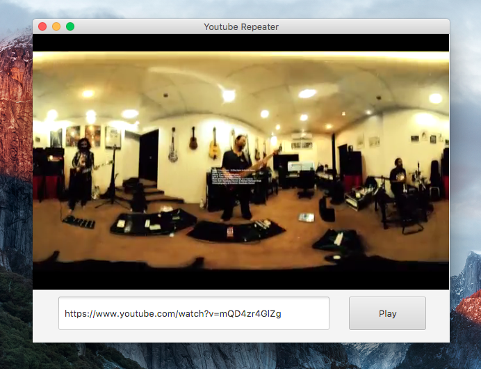

## Youtube Repeater

This is my first JavaFx project, so please pardon the messy, hacky code. I also apologize for being irresponsible with the exception handling. I will clean up the codes as I learn more. 

### What does it do? 

You pass a valid youtube video URL and it loops the video. If you're interested to know the looping works, please check out `MainController` and see how I construct the embed url. 

### How to build/run it? 

I will create stand alone packages soon. But for now you have to build it yourself or run the JAR file I built. 

###### Using the prebuilt JAR file 

If you have Java installed, this command should work - 

	java -jar youtube-repeater.jar

On Windows, the JAR file **might** launch with Java if you double click it. 

###### Building Yourself

- First clone the git repository
- Package the JAR file using maven: 

		mvn package	
	
- Run it using the above command. 	